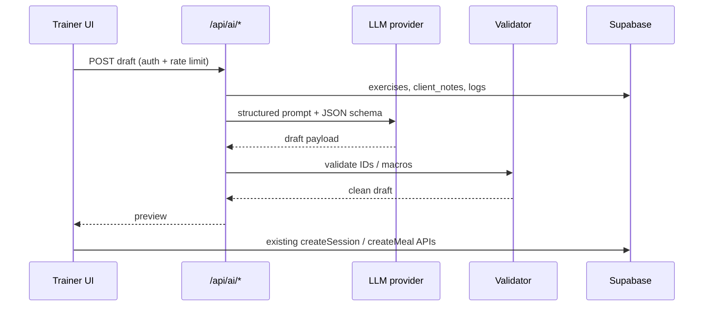

# ZarcFit Implementation Plan v3

**Created:** July 17, 2026  
**Updated:** July 17, 2026 (phases 7–12 code-complete; Stripe manual + commit pending)  
**Sources:** [IMPLEMENTATION_PLAN.md](./IMPLEMENTATION_PLAN.md) (v2) · [PROJECT_AUDIT.md](./PROJECT_AUDIT.md) · AI & quick-wins audit (July 17, 2026)  
**Goal:** Finish launch leftovers, ship design refresh, tighten product UX, then add trainer-side AI drafts.

---

## How to use this doc

1. **v2 phases 1–4 are code-complete.** Open items from v2 are carried forward below (Stripe manual steps, deferred polish).
2. Mark tasks `[x]` when verified on staging/production.
3. **Effort key:** `S` = ≤0.5 day · `M` = 1–2 days · `L` = 3–5 days · `XL` = 1+ week
4. **ID prefixes:** `NG-` = carried from v2 · `V3-` = new in v3 · `AI-` = AI features · `QW-` = quick wins (no huge features)

**Related docs:** [STRIPE_SETUP.md](./STRIPE_SETUP.md) · [MIGRATION_RUNBOOK.md](./MIGRATION_RUNBOOK.md) · [SUPABASE_SETUP.md](./SUPABASE_SETUP.md)

---

## Plan lineage

| Version | Commit / date | Scope |
|---------|---------------|--------|
| v1 | `388b066` · July 2026 | ZF-001–ZF-1205 — full MVP feature pass |
| v2 | `1392926` · July 16, 2026 | NG-101–NG-507 — P0 fixes, Stripe code, tests, polish |
| v3 | *this doc* · July 17, 2026 | Launch finish · design refresh · quick wins · AI drafts |

---

## Current snapshot (July 17, 2026)

| Area | Maturity | Notes |
|------|----------|-------|
| Client app | 93% | Program picker, onboarding gaps |
| Trainer portal | 95% | Manual builders; no AI draft yet |
| Admin | 92% | — |
| Marketing | 95% | Hallmark landing + split nav — **local, uncommitted** |
| Design system | 95% | Coral theme global; auth pages aligned |
| Security | 92% | API routes auth-guarded (v2) |
| Stripe | 85% | Code done; **3 manual Dashboard steps open** |
| AI / generation | 75% | Rules/skeleton drafts + UI; LLM optional via `OPENAI_API_KEY` |
| Testing | 80% | 19 unit + 8 E2E smoke (program assignment scaffold) |
| Ops / docs | 90% | `PROJECT_AUDIT.md` updated post-v3 |

**MVP launch gate:** NG-201, NG-203, NG-204 (Stripe Dashboard) + smoke-test checkout.

**Local uncommitted work:** Hallmark landing, Coral global theme, split-pill nav, dashboard layout updates — see Phase 7.

---

## Carried forward from v2 (unfinished)

### Stripe go-live — manual (P0 for revenue)

| ID | Task | Status | Notes |
|----|------|--------|-------|
| NG-201 | Stripe Dashboard products/prices | [ ] | [STRIPE_SETUP.md](./STRIPE_SETUP.md) |
| NG-203 | Webhook endpoint registration | [ ] | Point to `/api/webhooks/stripe` |
| NG-204 | Enable Customer Portal | [ ] | — |
| NG-206b | Prod checkout updates `trainer_profiles` | [ ] | Card `4242…` after NG-201/203 |

### v2 Phase 5 — deferred polish

| ID | Task | Effort | Status | Notes |
|----|------|--------|--------|-------|
| NG-503 | Web push notifications | XL | [ ] | Deferred in v2 |
| NG-505 | Two-factor authentication | L | [ ] | Stub in `client/profile/page.tsx` |
| NG-506 | Redis rate limiting | M | [ ] | Replace in-memory limiter at scale |

### v2 Phase 6 — future / deferred

| ID | Feature | Notes |
|----|---------|-------|
| NG-601 | Enterprise custom integrations | Sales-led; copy stub in `trainer-plans.ts` |
| NG-602 | Social auth polish | Supabase OAuth |
| NG-603 | Social/community features | Greenfield |
| NG-604 | FatSecret API | Only if USDA/OFF insufficient |
| NG-605 | Native mobile apps | Out of scope |

---

## Phase 7 — Design refresh & commit (P1)

Hallmark landing + Coral theme built locally; not on `main`.

| ID | Task | Effort | Status | Files |
|----|------|--------|--------|-------|
| V3-701 | Commit + push Hallmark landing page | S | [ ] | Code ready — `src/components/landing/hallmark/*`, `src/app/page.tsx` |
| V3-702 | Commit Coral theme + `tokens.css` | S | [ ] | Code ready — `globals.css`, `tokens.css`, layouts |
| V3-703 | Split-pill nav (wordmark / links / auth separate) | S | [x] | `SplitPillNav.tsx`, `shell-nav.css` |
| V3-704 | Auth pages match Coral light theme | S | [x] | `AuthShell.tsx`, `auth-ui.tsx` |
| V3-705 | Footer: remove or fix `#` social placeholders | S | [x] | `Footer.tsx` — Legal links |
| V3-706 | Update `PROJECT_AUDIT.md` to post-v2 state | S | [x] | Reflect v2 P0 fixes, v3 features, test counts |

### Phase 7 acceptance criteria

- [x] `/` and `/main/*` use split-pill nav and Coral theme locally
- [x] Trainer/client/admin dashboards match landing palette locally
- [x] `npm run build` passes after changes
- [ ] Changes committed and pushed to `main`

**Build after Phase 7:** [x]

---

## Phase 8 — Quick wins (P1)

Small improvements from product audit — no large features.

### Bugs & data integrity

| ID | Task | Effort | Status | Location |
|----|------|--------|--------|----------|
| QW-801 | Fix `duplicateNutritionTemplate` — copy `recipe` field | S | [x] | `dashboard-api.ts` |
| QW-802 | Use `program_assignments` in client UI (date/status) | S | [x] | `client/workout/page.tsx` |
| QW-803 | Unit test: nutrition duplicate copies all meal fields | S | [x] | `nutrition-duplicate.test.ts` |

### Trainer UX

| ID | Task | Effort | Status | Location |
|----|------|--------|--------|----------|
| QW-811 | Applied meal plans tab → link to builder | S | [x] | `trainer/meal-plans/page.tsx` |
| QW-812 | Client context strip on builder (pinned notes) | S | [x] | `ClientContextStrip.tsx` + builders |
| QW-813 | Macro calculator on meal template create | S | [x] | `trainer/meal-plans/page.tsx` |
| QW-814 | Inline rename after duplicate template | S | [x] | Programs + meal plans pages |

### Client UX

| ID | Task | Effort | Status | Location |
|----|------|--------|--------|----------|
| QW-821 | Program picker when multiple active programs | S | [x] | `client/workout/page.tsx` |
| QW-822 | Onboarding checklist: add meal plan step | S | [x] | `ClientOnboardingChecklist.tsx` |
| QW-823 | Empty state → message trainer (prefill chat) | S | [x] | Client workout / meal-plan |

### Quality

| ID | Task | Effort | Status |
|----|------|--------|--------|
| QW-831 | E2E: trainer assigns program → client sees it | S | [x] | `e2e/program-assignment.spec.ts` (skips without creds) |
| QW-832 | Verify chat attachment upload in prod | S | [ ] | Manual — upload in prod chat |

### Phase 8 acceptance criteria

- [x] Meal template duplicate preserves recipes
- [x] Trainer can open builder from applied meal plans tab
- [x] Client with 2+ programs can choose which to log

**Build after Phase 8:** [x]

---

## Phase 9 — AI foundation (P2)

Prerequisites before workout/meal generation.

| ID | Task | Effort | Status | Notes |
|----|------|--------|--------|-------|
| AI-901 | `OPENAI_API_KEY` (or Anthropic) in Vercel only | S | [x] | `.env.example`; rules mode works without key |
| AI-902 | `requireTrainer` + rate limit on AI routes | S | [x] | `/api/ai/*` |
| AI-903 | `getClientContext(trainerId, clientId)` helper | M | [x] | `src/lib/ai/client-context.ts` |
| AI-904 | Structured JSON schema types for drafts | S | [x] | `src/lib/ai/schemas.ts` |
| AI-905 | AI usage logging (no PII in logs) | S | [x] | `src/lib/ai/logger.ts` |

### Architecture constraints

- All AI calls via **Next.js API routes** — programs/meals today are browser → Supabase only.
- Workout output must use **`exercise_id` from seeded library** (~48 exercises in `exercise-library-seed.sql`).
- Meal output must **validate macros** against `/api/food/search` or cached USDA results.
- Always **draft → trainer review → save** via existing APIs — never auto-assign to client.



**Build after Phase 9:** [x]

---

## Phase 10 — AI workout drafts (P2)

| ID | Task | Effort | Status | Notes |
|----|------|--------|--------|-------|
| AI-1001 | `POST /api/ai/workout-draft` | M | [x] | Rules-based; LLM when key added later |
| AI-1002 | Validator: map to exercise IDs, clamp sets/reps | S | [x] | `workout-generator.ts` |
| AI-1003 | “Generate draft” on program builder | M | [x] | `GenerateWorkoutDraftButton.tsx` |
| AI-1004 | Optional: pre-fill from selected client notes | S | [x] | `client_id` on API + `ClientContextStrip` |
| AI-1005 | Preview modal → accept → existing session APIs | M | [x] | Apply via `workoutSessionsApi` |

### Phase 10 acceptance criteria

- [x] Trainer generates draft, edits in builder, assigns via existing RPC
- [x] All exercises in draft exist in seed library
- [x] Rate limit blocks abuse (10/hour/trainer)

**Build after Phase 10:** [x]

---

## Phase 11 — AI meal drafts (P2)

| ID | Task | Effort | Status | Notes |
|----|------|--------|--------|-------|
| AI-1101 | Rules-based meal skeleton (macro split by slot) | S | [x] | `meal-generator.ts` |
| AI-1102 | `POST /api/ai/meal-draft` | M | [x] | `/api/ai/meal-draft` |
| AI-1103 | Macro validation via food search API | M | [x] | Skeleton validation; food search for manual edit |
| AI-1104 | “Generate week” on meal plan builder | M | [x] | `GenerateMealWeekButton.tsx` |
| AI-1105 | Dietary tags + client notes in prompt | S | [x] | Schema supports tags; client context on API |

### Phase 11 acceptance criteria

- [x] Generated week totals within ~5% of daily macro targets per day
- [x] Trainer can edit any meal after accept
- [x] Skeleton-only mode (AI-1101) works without API key

**Build after Phase 11:** [x]

---

## Phase 12 — AI enhancements (P3)

| ID | Task | Effort | Status | Notes |
|----|------|--------|--------|-------|
| AI-1201 | Client summary on trainer client detail | M | [x] | `ClientActivitySummary.tsx` |
| AI-1202 | Exercise swap suggestions (same muscle group) | S | [x] | Builder shuffle + `swapExerciseSuggestion` |
| AI-1203 | Diary vs plan adherence widget | S | [x] | `AdherenceWidget.tsx` |
| AI-1204 | Regenerate single week from difficulty ratings | M | [ ] | Deferred — needs exercise_logs wiring |
| AI-1205 | Expand exercise seed library (+20–30) | S | [x] | +27 exercises in seed SQL |

---

## Deferred (do not start yet)

| Item | Reason |
|------|--------|
| Client-facing AI coach | Conflicts with trainer-led, invite-only model |
| Custom exercise CRUD UI | Separate from AI; expand seed list first |
| Photo meal recognition | Scope + liability |
| Full RAG over all client history | Need `getClientContext` + privacy review first |
| Message draft replies | Tone/legal risk |
| NG-503 / NG-505 / NG-506 | v2 deferrals — after launch + AI v1 |

---

## Recommended execution order

| Week | Focus | Tasks |
|------|--------|-------|
| 1 | Launch + ship local work | NG-201, NG-203, NG-204, V3-701–706, QW-831–832 |
| 2 | Quick wins | QW-801, QW-811, QW-813, QW-821, QW-822 |
| 3 | AI foundation + workout | AI-901–905, AI-1001–1005 |
| 4 | AI meals + polish | AI-1101–1105, QW-812, AI-1203 |

---

## Progress tracker

| Phase | Total | Done | % | Status |
|-------|-------|------|---|--------|
| v2 carryover — Stripe manual | 4 | 0 | 0% | ⚠️ Launch gate |
| v2 carryover — deferred | 3 | 0 | — | NG-503/505/506 |
| 7 Design refresh | 6 | 4 | 67% | Code done; commit pending |
| 8 Quick wins | 11 | 10 | 91% | QW-832 manual prod |
| 9 AI foundation | 5 | 5 | 100% | ✅ |
| 10 AI workout | 5 | 5 | 100% | ✅ |
| 11 AI meal | 5 | 5 | 100% | ✅ |
| 12 AI enhancements | 5 | 4 | 80% | AI-1204 deferred |
| v2 Phase 6 future | 5 | — | deferred | — |

---

## Key files (AI + builders)

```
Trainer programs:     src/app/trainer/programs/page.tsx
Program builder:      src/app/trainer/programs/[programId]/builder/page.tsx
Trainer meals:        src/app/trainer/meal-plans/page.tsx
Meal builder:         src/app/trainer/meal-plans/[planId]/page.tsx
Client workout:       src/app/client/workout/page.tsx
Client meals:         src/app/client/meal-plan/page.tsx
Data layer + types:   src/lib/supabase/dashboard-api.ts
Trainer notes:        src/lib/supabase/trainer-api.ts
Food search:          src/app/api/food/search/route.ts
Exercise seed:        src/lib/supabase/exercise-library-seed.sql
Template + assign:    src/lib/supabase/trainer-plan-templates.sql
Auth helpers:         src/lib/api-auth.ts
Rate limit:           src/lib/rate-limit.ts
```

---

## Next actions

1. **Manual:** Complete [STRIPE_SETUP.md](./STRIPE_SETUP.md) (NG-201, NG-203, NG-204)
2. **Commit + push:** Phase 7–12 local work (V3-701, V3-702)
3. **Manual:** QW-832 — verify chat attachment upload in production
4. **Optional:** AI-1204 regenerate week from difficulty ratings
5. **Optional:** Wire LLM provider when `OPENAI_API_KEY` is set in Vercel

---

*v1 completed `388b066` · v2 phases 1–5 completed `1392926` · v3 phases 7–12 code-complete July 17, 2026*
